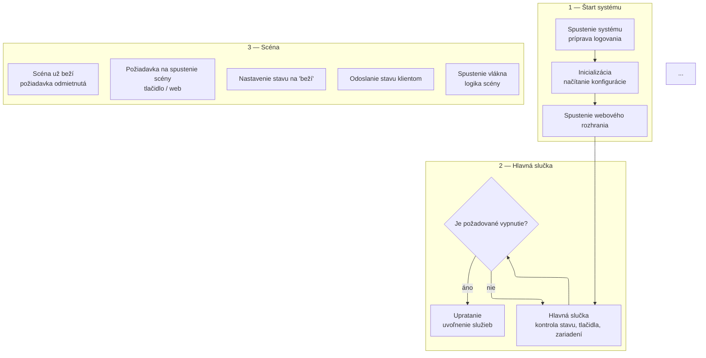

# Štandard pre tvorbu softvérových diagramov (SW_DIAGRAMS)

Tento dokument určuje pravidlá a odporúčania pre tvorbu všetkých diagramov v priečinku SW_DIAGRAMS. Cieľom je, aby boli diagramy:
- **Jednoduché na pochopenie** (aj pre neprogramátora)
- **Konzistentné** naprieč celým projektom
- **Prehľadné a čitateľné** (žiadne prekrývajúce sa čiary, bloky majú dostatočné rozostupy)
- **Slovné, nie programátorské** (názvy blokov a popisy sú v slovenčine, bez názvov funkcií)

---

## 1. Základné pravidlá

- **Používaj bloky (nodes)** na vyjadrenie logických krokov, stavov alebo komponentov.
- **Každý blok má jasný, slovný názov** (napr. „Spustenie systému“, „Hlavná slučka“, „Záver scény“).
- **Popisy v blokoch** sú stručné, maximálne 2-3 riadky, žiadne dlhé vety.
- **Nepoužívaj názvy funkcií, premenných ani kódu** (napr. nie `main()`, ale „Spustenie systému“).
- **Väzby (šípky/čiary)** majú jasný smer a nikdy sa nekrížia, ak to ide.
- **Rozdeľuj logické celky do subgraphov** (napr. „Štart systému“, „Beh scény“, „Externé zastavenie“).
- **Rozlišuj rozhodovacie body** (napr. „Je požadované vypnutie?“) pomocou špeciálnych blokov (napr. tvar kosoštvorca).
- **Farby a štýly**: Používaj jemné pastelové farby na rozlíšenie typov blokov (štart, slučka, scéna, stop, súbor, watchdog...).
- **Vždy popíš význam špeciálnych symbolov** (napr. čo znamená prerušovaná čiara).

---

## 2. Odporúčaný štýl (inšpirácia diagramami 5.2 a 5.3)

- **Jeden diagram = jeden proces/flow** (napr. „Životný cyklus backendu“, „Tick FSM engine“).
- **Subgraphy**: Každý väčší logický celok daj do subgraphu s jasným názvom (napr. `subgraph A["1 — Štart systému"]`).
- **Bloky v subgraphe** zoradi tak, aby sa šípky nemuseli krížiť.
- **Väzby medzi subgraphmi** veď vždy mimo blokov, nie cez ne.
- **Rozhodovacie body** (napr. „Scéna už beží?“) dávaj do samostatných blokov, ideálne v tvare kosoštvorca.
- **Príklady názvov blokov:**
    - „Spustenie systému\npríprava logovania“
    - „Hlavná slučka\nkontrola stavu, tlačidla, zariadení“
    - „Požiadavka na spustenie scény\ntlačidlo / web / správa“
    - „Záver scény\nvypnutie zariadení, aktualizácia stavu“
    - „Externé zastavenie\nvolané z webu“
- **Príklady väzieb:**
    - „áno“/„nie“ pri rozhodovacích bodoch
    - „zápis stavu“ prerušovanou čiarou

---

## 3. Technické odporúčania

- **Používaj Mermaid syntax** (flowchart TD, subgraph, classDef...)
- **Nastav layout na elk** (pre lepšie rozmiestnenie blokov):
  ```
  ---
  config:
    layout: elk
  ---
  ```
- **Exportuj vždy do PNG, SVG a PDF** vo vysokom rozlíšení (šírka aspoň 4000, scale aspoň 2-3).
- **Súbor .mmd pomenuj podľa témy** (napr. `diagram_5_2_backend_lifecycle_final.mmd`).
- **Vždy si skontroluj výsledok, či sa nič neprekrýva a texty sú čitateľné.**

---

## 4. Vzorová štruktúra (Mermaid)



---

## 5. Kontrola pred commitom

- Skontroluj, že:
    - Všetky bloky majú slovné názvy
    - Diagram je čitateľný a neprekrýva sa
    - Exporty sú v PNG, SVG, PDF
    - Súbor je v správnom priečinku a pomenovaný podľa témy

---

**Tento štandard platí pre všetky nové aj upravované diagramy v projekte.**